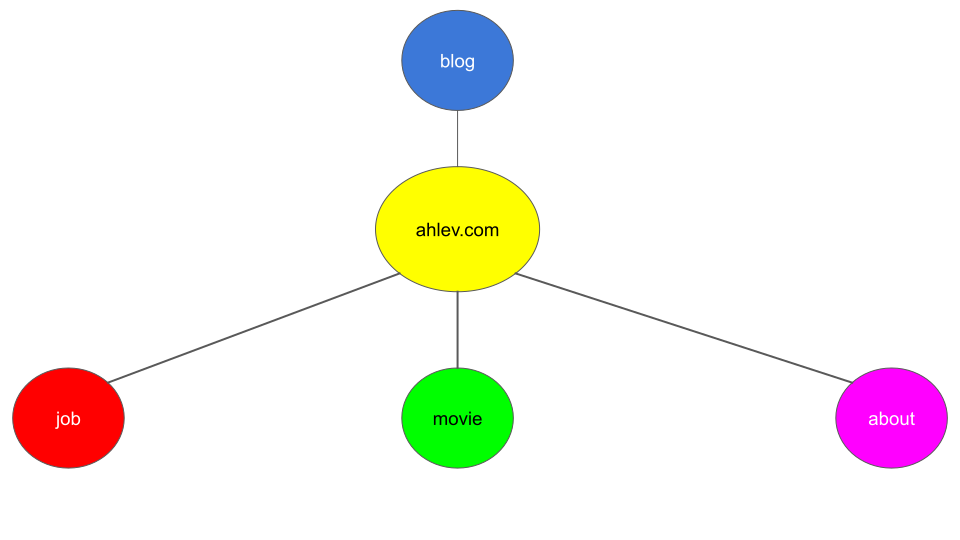

# AHLEV.COM

This is the main app.

## Architecture Overview

ahlev.com is composed of many independent and dependent modules. Each of them is housed inside an isolated repository. They will be downloaded and installed as the npm packages, which are the dependencies of the main app.

## why?
1- Each module is installable and uninstallable. 
2- Each module is resuable. 
3- Each team can be set up to see only their own code. 

## what if some modules need to communicate with other?

May be use [Addon](https://cli.emberjs.com/release/writing-addons/intro-tutorial/), and make it the only common dependency of other engines? Not really sure it will work yet. I am going to find out.

## Prerequisites

You will need the following things properly installed on your computer.

* [Git](https://git-scm.com/)
* [Node.js](https://nodejs.org/) (with npm)
* [Ember CLI](https://ember-cli.com/)
* [Google Chrome](https://google.com/chrome/)

## Installation

* `git clone <repository-url>` this repository
* `cd ember-ahlev-app`
* `npm install`

## Running / Development

* `ember serve`
* Visit your app at [http://localhost:4200](http://localhost:4200).
* Visit your tests at [http://localhost:4200/tests](http://localhost:4200/tests).

### Code Generators

Make use of the many generators for code, try `ember help generate` for more details

### Running Tests

* `ember test`
* `ember test --server`

### Linting

* `npm run lint:hbs`
* `npm run lint:js`
* `npm run lint:js -- --fix`

### Building

* `ember build` (development)
* `ember build --environment production` (production)

### Deploying

Specify what it takes to deploy your app.

## Further Reading / Useful Links

* [ember.js](https://emberjs.com/)
* [ember-cli](https://ember-cli.com/)
* Development Browser Extensions
  * [ember inspector for chrome](https://chrome.google.com/webstore/detail/ember-inspector/bmdblncegkenkacieihfhpjfppoconhi)
  * [ember inspector for firefox](https://addons.mozilla.org/en-US/firefox/addon/ember-inspector/)
